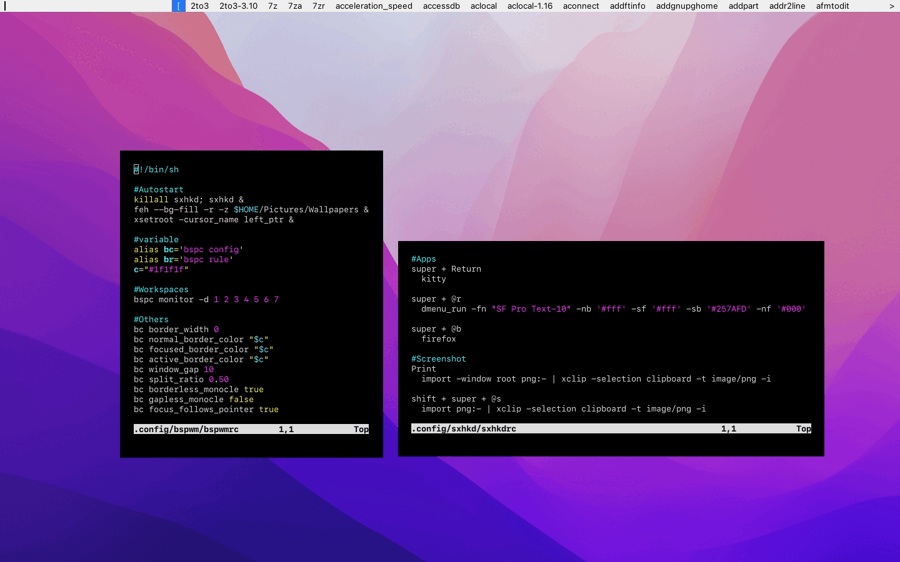

<h1 align="center">Dotfiles</h1>
<h4 align="center">dotfiles by AikeL01</h4>

<p align="center">
  
</p>

# Installation
```
git clone https://github.com/AikeL01/dotfiles.git && cd dotfiles
./install.sh 
```

# KeyBinds
| Key | Action |
| ----- | ----- |
| super + Return | kitty |
| super + r | dmenu |
| super + b | firefox |
| Print | import (imagemagick) |
| super + shift + [1-7] | focus on desktop 1-7 |
| super + shift + e | exit wm |
| super + shift + r | restart wm |
| super + Tab | toggle floating/tiling |
| super + q | kill focused window |
| alt + Tab | toggle window focus |
| super + space | toggle fullscreen |
| super + m | toggle monocle |
| super + Arrows [Up,Down,Left,Right] | resize window |
| super + shift + [Up,Down,Left,Right] | swap window |


# Stuffs In Rice
  - AppLauncher: dmenu
  - Font: apple-fonts (https://aur.archlinux.org/packages/apple-fonts)
  - Shell: zsh
  - Terminal: kitty
  - TextEditor: nvim
  - WindowManager: bspwm

## Others
  - FileManager: pcmanfm
  - ImageViewer: feh
  - ScreenShot: imagemagick
  - TextEditor: nvim
  - VideoPlayer: mpv
  - WebBrowser: firefox with [Monterey Theme](https://github.com/vinceliuice/WhiteSur-firefox-theme)
